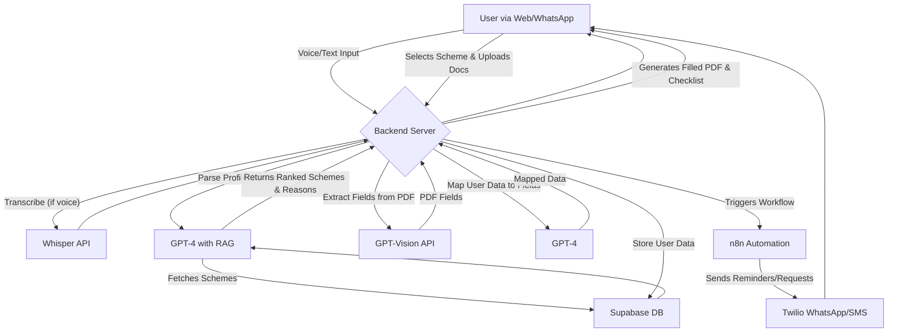

# YojanaMitra 🇮🇳 | Your AI Copilot for Government Schemes

[](https://nextjs.org/)
[](https://www.typescriptlang.org/)
[](https://nodejs.org/)
[](https://supabase.io/)
[](https://openai.com/)
[](https://n8n.io/)

YojanaMitra is an AI-powered multilingual copilot designed to help every Indian discover, understand, and successfully apply for government schemes they are eligible for. We bridge the information and accessibility gap, ensuring no one misses out on vital benefits.


## 🤔 The Problem

Millions of eligible Indians miss out on government benefits like scholarships, health insurance, pensions, and MSME subsidies. The reasons are universal: confusing eligibility criteria, complex application forms, language barriers, and a lack of timely reminders. This digital and informational divide disproportionately impacts students, women, rural families, and first-generation applicants.

We need an assistant that doesn't just find schemes but actually helps **get the application done**—simply, correctly, and on time.

## ✨ Our Solution: YojanaMitra

YojanaMitra is a multilingual (English/Hindi + regional languages) AI copilot that acts as a personal guide for government schemes.

It chats with users via voice or text to understand their profile, matches them to the right schemes with clear reasoning, and automates the most tedious parts of the application process.

### 🚀 Key Features

* 🗣️ **Multilingual Voice & Text Interface**: Uses OpenAI Whisper and TTS for users with low literacy.
* 🎯 **Intelligent Scheme Matching**: Leverages RAG to find the most relevant schemes and explains eligibility in simple terms.
* ✍️ **Automated Form Filling**: GPT-Vision parses official PDFs, and the system autofills them with the user's data.
* 📋 **Automated Document Support**: Generates supporting letters, affidavits, and a personalized document checklist.
* 🔔 **Smart Reminders**: n8n automations send deadline reminders and follow-ups for missing documents via WhatsApp/SMS.
* ✅ **Human-in-the-Loop**: Flags applications with low confidence scores for optional human review.
* 📦 **One-Click Application Kit**: Users can download a zip file containing the filled form, checklist, and supporting documents.

## 🔧 Tech Stack & Architecture

Our architecture is designed to be scalable, secure, and user-friendly.

* **Frontend**: Next.js (TypeScript), Tailwind CSS
* **Backend**: Node.js / Next.js API Routes
* **Database & Auth**: Supabase (PostgreSQL, Auth, Storage)
* **AI & Language Models**: OpenAI (GPT-4 for reasoning, GPT-Vision for OCR, Whisper for STT, TTS for voice output)
* **Automation**: n8n for workflow automation (reminders, document collection)
* **Communication**: Twilio for WhatsApp/SMS integration

### System Flow


## ⚙️ Quickstart: Getting Started Locally

To set up and run this project on your local machine, follow these steps.

### Prerequisites

* Node.js (v18 or later)
* npm / yarn
* Git
* A Supabase account
* An OpenAI API key
* An n8n instance (local or cloud)
* A Twilio account

### Installation & Setup

1.  **Clone the repository:**
    ```bash
    git clone [https://github.com/your-username/YojanaMitra.git](https://github.com/your-username/YojanaMitra.git)
    cd YojanaMitra
    ```

2.  **Install dependencies:**
    ```bash
    npm install
    ```

3.  **Set up environment variables:**
    * Create a file named `.env.local` in the `YojanaMitra` directory.
    * Add the following environment variables:
    ```env
    # OpenAI Configuration (Required)
    OPENAI_API_KEY=your_openai_api_key_here

    # Twilio Configuration (Required for WhatsApp/SMS)
    TWILIO_ACCOUNT_SID=your_twilio_account_sid
    TWILIO_AUTH_TOKEN=your_twilio_auth_token
    TWILIO_FROM_NUMBER=whatsapp:+14155238886

    # Supabase Configuration (Optional, for database storage)
    SUPABASE_URL=your_supabase_url
    SUPABASE_KEY=your_supabase_anon_key

    # Next.js Configuration
    NEXT_PUBLIC_APP_URL=http://localhost:3000
    ```
    
    **Note:** 
    - OpenAI API key is required for all AI features (Whisper, GPT, TTS)
    - Twilio credentials are required for WhatsApp/SMS reminders
    - Supabase is optional but recommended for production use

4.  **Install dependencies:**
    ```bash
    cd YojanaMitra
    npm install
    ```

5.  **Set up the Supabase database (Optional):**
    * Go to the SQL Editor in your Supabase project.
    * Create tables for storing user profiles, applications, and scheme data if needed.
    * For basic functionality, the app works with local JSON files in the `data/` directory.

6.  **Seed scheme data (Optional):**
    ```bash
    npm run seed
    ```
    This will populate the `data/schemes.json` file with sample schemes.

7.  **Run the development server:**
    ```bash
    npm run dev
    ```
    Open [http://localhost:3000](http://localhost:3000) in your browser to see the result.

## 🎯 Usage Guide

### Complete Workflow

1. **User Input**: 
   - Users can either type or speak (voice recording) their information in Hindi or English
   - The system uses OpenAI Whisper to transcribe voice input

2. **Profile Extraction**:
   - GPT-4 extracts structured profile data (name, age, income, caste, education, etc.)
   - Profile is stored and used for scheme matching

3. **Scheme Matching**:
   - RAG-based matching finds relevant schemes from the database
   - Each scheme gets a confidence score and explanation
   - Low-confidence matches are flagged for human review

4. **Form Filling**:
   - User selects a scheme
   - System automatically extracts PDF form fields
   - Profile data is mapped and filled into the PDF

5. **Document Generation**:
   - System generates supporting letters, affidavits, and checklists
   - All documents are in Hinglish (Hindi + English) for accessibility

6. **Application Kit**:
   - User downloads a zip file containing:
     - Filled application form (PDF)
     - Supporting letter
     - Affidavit
     - Document checklist
     - README with instructions

7. **Reminders**:
   - Users can opt-in for WhatsApp/SMS reminders
   - n8n workflows can be configured for automated follow-ups

## 🔑 API Endpoints

- `POST /api/profile` - Extract profile from text/voice
- `POST /api/whisper` - Transcribe audio to text
- `POST /api/match` - Find matching schemes
- `POST /api/fillpdf` - Fill PDF forms automatically
- `POST /api/generate-docs` - Generate supporting documents
- `POST /api/kit` - Create downloadable application kit
- `POST /api/send-reminder` - Send WhatsApp/SMS reminders
- `POST /api/tts` - Text-to-speech conversion
- `POST /api/review` - Human-in-the-loop review flagging

## 📸 Demo & Screenshots

Here's a look at YojanaMitra in action.

**1. Simple Conversational Onboarding**


**2. Clear Scheme Recommendations**


**3. One-Click Autofilled PDF**


**4. WhatsApp Deadline Reminder**


## 📜 License

This project is licensed under the MIT License. See the [LICENSE](LICENSE) file for details.
